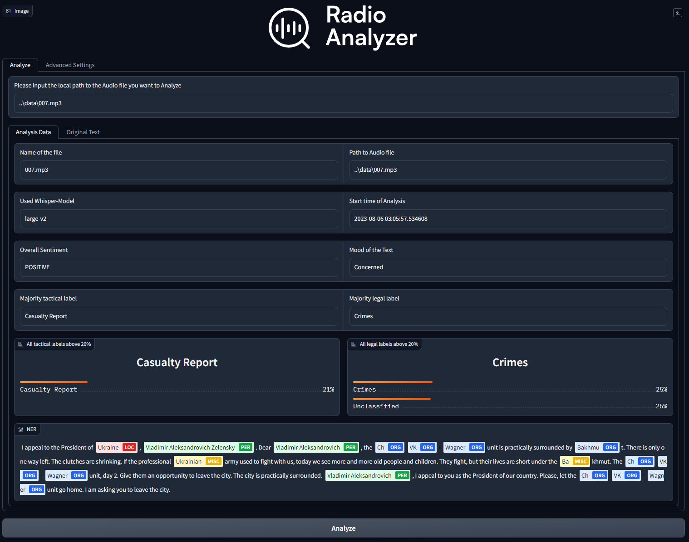

 

**Radio-Analyzer** is a cutting-edge tool designed to efficiently transcribe, translate, and analyze intercepted Russian radio communication from Ukraine using advanced AI technologies.

Key Features:

- **Automated Transcription and Translation**: Leveraging state-of-the-art AI technologies, Radio-Analyzer swiftly and efficiently transcribes intercepted radio communication and translates it into various languages, facilitating rapid comprehension and analysis.

- **Named Entity Recognition (NER)**: By implementing NER algorithms, the tool can identify and extract significant entities within the transcriptions, providing valuable insights into the content of the communication.

- **Sentiment Analysis**: The software conducts sentiment analysis to capture the mood and emotional aspects of the communication. This feature can help identify potential indications of critical events or crimes.

- **Text Classification**: Radio-Analyzer employs advanced text classification techniques to categorize the transcribed text into predefined categories. This feature aids in identifying the nature of the communication, whether it contains tactical information or content of legal significance.

- **Data Aggregation and Visualization**: The results of the analysis are aggregated and presented in a clear, intuitive format, enabling easy interpretation and further investigation.

