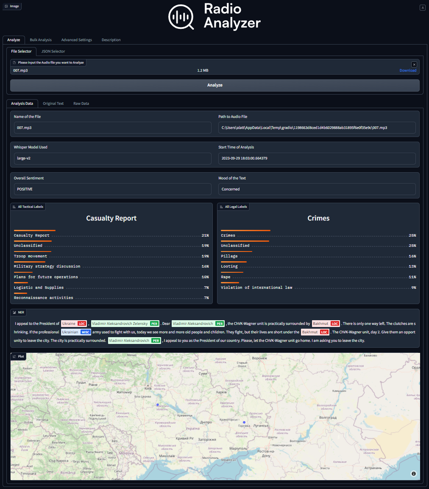
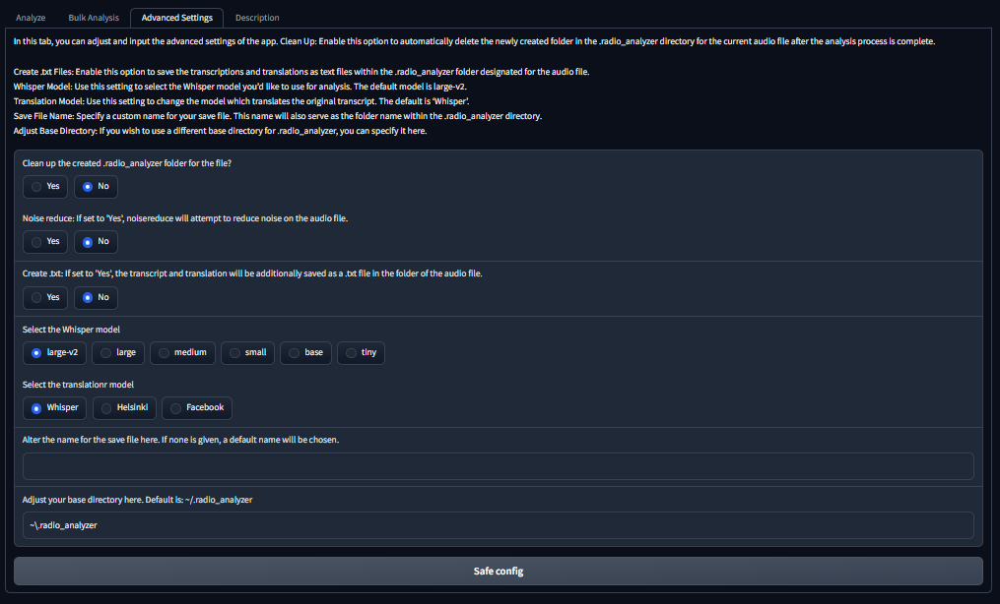
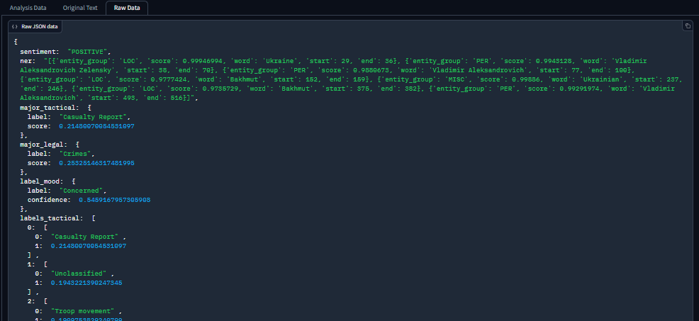

<br>
<div style="text-align:center;">
    
</div>

<br>
<div align="center">
<a href="#key-features">Key Features</a> - 
<a href="#system-requirements">System Requirements</a> - 
<a href="#ffmpeg">ffmpeg</a> - 
<a href="#setup-guide">Setup Guide</a>
</div>
<br>

**Radio-Analyzer** is a cutting-edge tool designed to efficiently transcribe, translate, and analyze intercepted Russian radio communication from Ukraine using advanced AI technologies.

The main goal of this Software is to give everyone the Possibility to Analyze (not only) Russian Audiofiles from the War in Ukraine, without the need to have any Python or AI skills.


# Overlay and Features

<br>

<div align="center">

<figcaption>Obtain a concise and comprehensive overview of the analysis results</figcaption>
</div>


## Key Features:

- **Automated Transcription and Translation**: Leveraging state-of-the-art AI technologies like Open-AI´s [Whisper](https://github.com/openai/whisper), Radio-Analyzer swiftly and efficiently transcribes intercepted radio communication and translates it into various languages, facilitating rapid comprehension and analysis.

- **Named Entity Recognition (NER)**: By implementing NER algorithms, the tool can identify and extract significant entities within the transcriptions, providing valuable insights into the content of the communication.

- **Sentiment Analysis**: The software conducts sentiment analysis to capture the mood and emotional aspects of the communication. This feature can help identify potential indications of critical events or crimes.

- **Text Classification**: Radio-Analyzer employs advanced text classification techniques to categorize the transcribed text into predefined categories. This feature aids in identifying the nature of the communication, whether it contains tactical information or content of legal significance.

- **Data Aggregation and Visualization**: The results of the analysis are aggregated and presented in a clear, intuitive format, enabling easy interpretation and further investigation.

- **Bulk Analysis**: Analyze multiple audio files consecutively with the *Bulk Analysis* feature.

- **Display**: Retrieve and display previous analysis results using the *JSON Selector*.

<br>
<div align="center">

<figcaption>Customize the parameters according to your requirements and hardware capabilities</figcaption>
</div>
<br><br>
<div align="center">

<figcaption>Analysis results are stored in a format that's easy to search and process</figcaption>
</div>
<br><br>

At present, Radio Analyzer is compatible with all audio file types that are supported by Whisper and, consequently,
by ffmpeg, for regular usage without the application of noise reduction. Nonetheless, when utilizing functionalities
that involve noise reduction, only .mp3 and .wav file formats are currently accommodated. Additionally, users have the
option to input .mp4 files; the audio content from these will be automatically extracted.


# System Requirements

It is recommended to run Radio Analyzer on Linux or Mac. While it is possible to run the program on Windows, users might encounter issues with the proper installation of `ffmpeg`, which is critical for the correct usage of Radio Analyzer.  
<br><br>**For error-free operation of Radio Analyzer, please ensure your system has at least 16GB of RAM! The analysis process will fail if the RAM is insufficient!**<br><br>

For the requirements and details of the Whisper models, see below or please refer to [Whisper's GitHub](https://github.com/openai/whisper#available-models-and-languages) page.

|  Size  | Parameters | English-only model | Multilingual model | Required VRAM | Relative speed |
|:------:|:----------:|:------------------:|:------------------:|:-------------:|:--------------:|
|  tiny  |    39 M    |     `tiny.en`      |       `tiny`       |     ~1 GB     |      ~32x      |
|  base  |    74 M    |     `base.en`      |       `base`       |     ~1 GB     |      ~16x      |
| small  |   244 M    |     `small.en`     |      `small`       |     ~2 GB     |      ~6x       |
| medium |   769 M    |    `medium.en`     |      `medium`      |     ~5 GB     |      ~2x       |
| large  |   1550 M   |        N/A         |      `large`       |    ~10 GB     |       1x       |

Please be aware that currently, Radio Analyzer only supports the Multilingual models.

It is recommended to have at least 20GB of free disk space available for Radio Analyzer and the required modules and datasets. Please be aware that on the first run, Radio Analyzer will need to download the necessary datasets (approximately 8GB), which will result in an extended runtime.


# ffmpeg
Several components of Radio Analyzer necessitate the installation of the command line tool [`ffmpeg`](https://ffmpeg.org/), which is accessible through most package managers:

```bash
# on Ubuntu or Debian
sudo apt update && sudo apt install ffmpeg

# on MacOS using Homebrew (https://brew.sh/)
brew install ffmpeg

# on Windows using Chocolatey (https://chocolatey.org/)
choco install ffmpeg

# on Windows using Scoop (https://scoop.sh/)
scoop install ffmpeg
```


# Setup Guide

Clone the repository using the following command:
```bash
git clone https://github.com/SeTruphe/Radio-Analyzer.git
```

### Manual Installation

You can manually install the program using the following commands:

```bash
# Create a new virtual environment
python3 -m venv .venv
# Activate the virtual environment
source .venv/bin/activate
# Install radio-analyzer
pip install .
```

To run the program, simply execute `radio-analyzer` in a terminal.  
Remember to activate the virtual environment created earlier with `source .venv/bin/activate` every time you open a new terminal.

### Using Scripts

Alternatively, you can use the scripts provided in the repository.

```bash
# Make scripts executable
chmod +x install.sh && chmod +x run.sh
# Run the installation script
./install.sh
# To run radio-analyzer, use the run script
./run.sh
```

### Installation on Windows
***Attention: This has not been tested yet!***

```bash
# Create a new virtual environment
python -m venv .venv
# Activate the virtual environment
.venv\Scripts\activate
# Install radio-analyzer
pip install .
```

After installation, you can start Radio Analyzer on Windows in the same way as on Linux and Mac. Just remember to activate the environment with `.venv\Scripts\activate`.

# Known Errors and Limitations

- On Windows, if you encounter an error stating that `ffmpeg` cannot be found even after installing it,
it is highly likely that the PATH entry for `ffmpeg` is missing. This issue commonly occurs after manually installing 
`ffmpeg` and is not well-documented on the [`ffmpeg`](https://ffmpeg.org/) website.
- If you experience a timeout in the Web GUI during the analysis process, it typically indicates insufficient RAM.
- Ensure that your hardware is capable of handling AI operations, especially when running Radio-Analyzer in a VM.
Be aware that otherwise the entire process can be time-consuming, even with short audio clips.
- To accommodate weaker hardware, consider using smaller, less resource-intensive Whisper models. These can be adjusted in the Advanced Settings menu.

